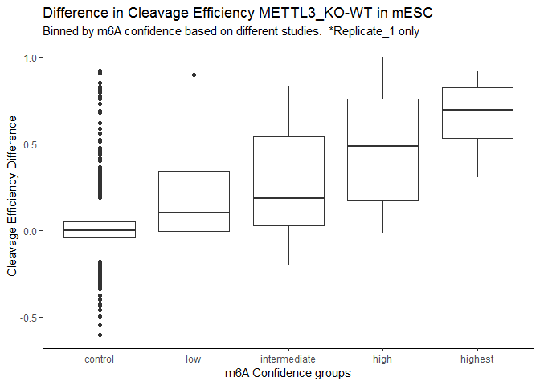

MAZTER\_mine example run and downstream analysis
================

In this folder there are 3 starting files:

-   **test\_KO1.bam and test\_WT1.bam**: Two alignment files which contain a subset of our MAZTER-seq derived data in mouse embryonic stem cells (mESC). KO1 stands for sample\_1 in METTL3-KO and WT1 for sample\_1 in control condition.
-   **geneAnnot.bed**: A BED-12 file which is a subset of the UCSC mouse gene annotation that contains genes with high confidence m6A sites.

The following commands will run the mazter\_mine pipeline in the test files (you will have to update `path/to/file` with the path to your local copy of the mouse genome file in FASTA format):

`Rscript bam2ReadEnds.R -i test_KO1.bam -g geneAnnot.bed`

`Rscript master_mine.R -i test_KO1.Rdata -g geneAnnot.bed -f /path/to/file/mm9_allchr.fa -u 60 -d 60`

`Rscript bam2ReadEnds.R -i test_WT1.bam -g geneAnnot.bed`

`Rscript master_mine.R -i test_WT1.Rdata -g geneAnnot.bed -f /path/to/file/mm9_allchr.fa -u 60 -d 60`

Running this commands will generate the output files:

-   test\_WT1.Rdata\_clvEffTable.txt
-   test\_KO1.Rdata\_clvEffTable.txt

With both output files `*_clvEffTable.txt` we can check the differences in cleavage efficiencies from WT and METTL3-KO conditions.

``` r
library(ggplot2)

KOsample <- read.delim("test_KO1.Rdata_clvEffTable.txt", row.names = 1,
                       stringsAsFactors = F)
WTsample <- read.delim("test_WT1.Rdata_clvEffTable.txt", row.names = 1,
                       stringsAsFactors = F)
knownSites <- read.delim("test-KnownSites.txt", row.names = 1)

WTsample$prevKnown <- "control"
WTsample[intersect(rownames(knownSites), rownames(WTsample)),]$prevKnown <- 
  as.character(knownSites[intersect(rownames(knownSites), rownames(WTsample)),])
WTsample$prevKnown <- factor(WTsample$prevKnown, levels = c("control", "low",
                                                            "intermediate", "high",
                                                            "highest"))

intTabl <- merge(KOsample, WTsample, by = "row.names")
intTabl$diff_KO_WT <- intTabl$avgClvEff.x - intTabl$avgClvEff.y 

ggplot(intTabl, aes(x = prevKnown, y = diff_KO_WT)) + geom_boxplot() + 
  ggtitle("Difference in Cleavage Efficiency METTL3_KO-WT in mESC",
          "Binned by m6A confidence based on different studies.  *Replicate_1 only") +
  ylab("Cleavage Efficiency Difference") + xlab("m6A Confidence groups") +
  theme_classic()
```



Additionally quality control reports have been created in the following files:

-   test\_KO1.Rdata\_MASTER-seq\_QC.pdf
-   test\_WT1.Rdata\_MASTER-seq\_QC.pdf

These quality controls depict: an optimal motif distance analysis, the cleavage efficiency measured at 3' and 5' with respect to ACA motif distance, and the tri-nucleotide frequency at 3' and 5' ends.
